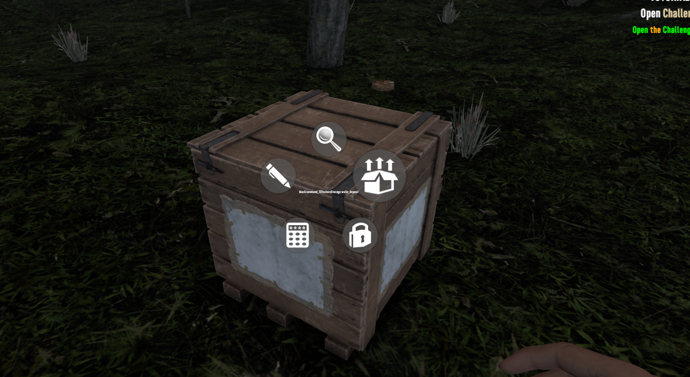

# Walle Mods — Performance (FPS Boost) & Quality of Life mods for 7 Days to Die

**Harmony mods for 7 Days to Die V2.x** (built and benchmarked on v2.5) that fix real, measured performance problems in the game's code — not another settings tweak pack. Created from a full code-level frame-time audit of the decompiled game, with every claim verified by an in-game A/B benchmark.

**[⬇ Download the latest release](https://github.com/EYamanS/7dtd-walle-mods/releases/latest)** — extract, run `install.bat`, play.

---

## ⚡ WallePerf — the performance / FPS boost mod

23 code patches targeting the engine's actual hotspots. Measured on an i7-12700K + RX 6800 XT with the included benchmark (same scene, patches toggled live, VSync off):

| Scenario | Average FPS | 1% low FPS (smoothness) |
|---|---|---|
| Base scene | **+5–7%** | **+4%** |
| 60-zombie horde | **+7.2%** | **+14.9%** |

What it actually fixes (full details in [ANALYSIS.md](ANALYSIS.md)):

- **Frame-time waste**: the dynamic music system scanned 50m of world *every frame*; the weather system fired an infinite-length SphereCast every frame; the UI re-parsed every binding every frame even when nothing changed; compass/map icons re-evaluated at 60 Hz. All cached or throttled.
- **Horde performance**: zombies beyond 15m no longer run full-rate obstacle physics; chasing zombies stop spamming duplicate pathfinding requests; cosmetic path smoothing (up to 100 physics casts per path) skipped beyond 20m; distant zombies stop casting shadows and stop animating while off-screen.
- **Stutter/hitches**: breaking or placing a block no longer rebuilds up to 9 chunks in a single frame (the classic dig-hitch); terrain mesh uploads trimmed; per-frame allocations removed (less GC stutter).
- Every patch has an on/off toggle in `WallePerfConfig.xml`, and `walleperf on|off` in the F1 console toggles all of them **live, without restarting** — test the difference yourself.

## 🎒 WalleQoL — the quality of life mod

- **Shared containers & stations (multiplayer)**: multiple players can use the **same chest, workbench, forge, cabinet, car, or dropped bag at the same time**, with live-syncing windows — no more "container in use". Built on the game's own shared-lock system (the one traders already use). Covers player storage, world loot (loot rolls exactly once, server-side — verified against the decompiled loot code), workstations, and lootable item entities; each scope has its own config toggle, and quest containers stay vanilla for quest integrity.
- **Quick deposit**: hold E on any of your placed containers → **"Deposit Items"** — tops up all matching stacks in the chest straight from your backpack without opening it. Shows `−N item` entries in the pickup feed, respects your locked backpack slots, skips chests you're locked out of.
- **Craft from containers**: crafting (and item repair) pulls missing ingredients straight from your placed storage within ~15m — no more shuttling iron between chest and workbench. Works at the campfire, workbench, chemistry station and cement mixer; **the forge works too** — recipes use your smelted bank units first, then cover the shortfall from chest smeltables at their material value, crediting leftover units back into the bank. Backpack is consumed first; container locks and user-locked container slots are respected; the pickup feed shows what came out of storage. Deliberately fenced so trader purchases, vending rent and lockpicks always use your real inventory — no free-money exploits.

## 📊 WalleBench — benchmark & profiler (for tinkerers)

In-game console commands (source repo only, not in the release zip):

- `bench auto` — fully automated A/B benchmark: god mode, position lock, VSync off, deterministic zombie horde, patches toggled on/off between segments, comparison table at the end.
- `bench profile 20` — subsystem profiler: ranked ms/frame table of where the main thread's time goes, live in your own game.

---

## 📥 Install

1. **[Download the latest release zip](https://github.com/EYamanS/7dtd-walle-mods/releases/latest)** and extract it anywhere
2. Run **`install.bat`** — it finds your game automatically (or asks for the folder)
3. Launch 7 Days to Die with **EasyAntiCheat disabled** (launcher checkbox) — DLL mods never load under EAC; this applies to every code mod, not just this one
4. **Multiplayer**: the host **and** every player install the mods

Verify: press F1 in game — you should see `[WallePerf] ... patches active` and `[WalleQoL] ... enabled`.

**Uninstall**: delete `WallePerf` and `WalleQoL` from the game's `Mods` folder.

## ⚙ Configuration

- `Mods/WallePerf/WallePerfConfig.xml` — every performance patch individually on/off (one experimental patch, `TerrainTangentSkip`, ships off by default)
- `Mods/WalleQoL/WalleQoLConfig.xml` — shared containers / quick deposit on/off
- Console: `walleperf on|off|status` — toggle all performance patches at runtime

## 🔧 Building from source

Requires a local 7 Days to Die install (the projects reference the game's assemblies) and the .NET SDK:

1. Set your game path in `src/Directory.Build.props` (`GameDir`)
2. `dotnet build src/WallePerf/WallePerf.csproj` (same for WalleQoL / WalleBench)
3. Builds auto-deploy to the game's `Mods` folder and refresh `prebuilt/`

**Releases are automated**: bump the version in `src/WallePerf/ModInfo.xml`, build, push to `main` — GitHub Actions packages the installer zip and publishes the release.

## 📝 How this was made

The entire game (`Assembly-CSharp.dll`, ~4,400 classes) was decompiled and audited subsystem by subsystem — game loop, AI/pathfinding, chunk/voxel meshing, rendering managers. The result is a ranked list of 24 concrete findings with file/line citations in **[ANALYSIS.md](ANALYSIS.md)**, three genuine vanilla bugs included. Patches were then implemented tier by tier and validated with the in-game benchmark after every round.

The decompiled game source is **not** part of this repository (it's The Fun Pimps' copyrighted code) — only our own mod source, analysis notes, and tooling.

## Compatibility

- Game version: **7 Days to Die V2.x** (developed and tested on **v2.5**, Unity 2022.3)
- Requires launching without EasyAntiCheat (standard for all DLL/Harmony mods)
- Server + all clients for multiplayer; QuickDeposit also works client-side only

## License

[MIT](LICENSE) — mod source and tooling only. 7 Days to Die is © The Fun Pimps.
